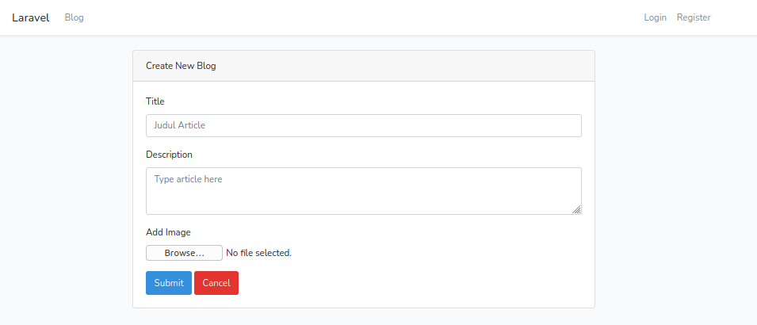
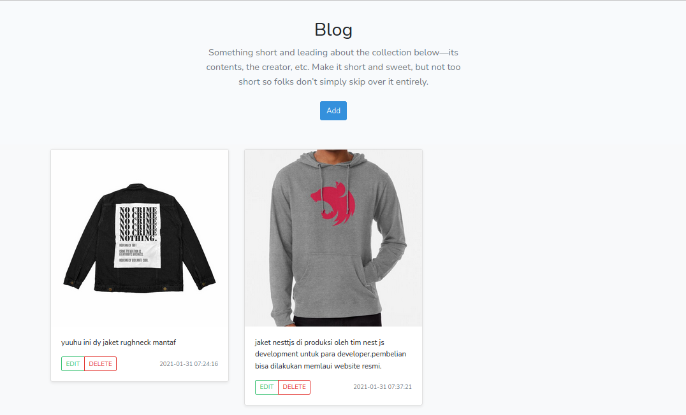

# Blog Laravel

## Config
```bash
# create model and migration
php artisan make:model Models/Blog -m

# create blog redquest
php artisan make:request BlogRequest

# link storage ke public dir
php artisan storage:link
```

# CRUD BLOG
```php
# routes/web.php
Route::group(['prefix' => 'blog'], function () {
    Route::get('/','BlogController@index')->name('blog.index');
    Route::get('/create','BlogController@create')->name('blog.create');
    Route::post('/','BlogController@store')->name('blog.store');
});

# Models/Bloog.php
class Blog extends Model
{
    use softDeletes;

    protected $fillable = [
        'title', 'description','image'
    ];
}


# request form validator
# Requests/BlogRequest.hp
public function rules()
{
    return [
        'title' => 'required|string',
        'description' => 'required|string',
        'image' => 'required|image|mimes:jpeg,png,jpg,gif,svg'
    ];
}

public function messages()
{
    return [
        'title.required' => 'Title is required',
        'description.required'  => 'Description is required',
        'image.required' => 'Image is required'
    ];
}


# controller untuk save file and retrieve path image
# BlogController.php
public function store(BlogRequest $request)
{
    $blog = $request->all();
    $blog['image'] = 'storage/'.$request->file('image')->store(
        'assets/blog', 'public'
    );
    Blog::create($blog);
    return redirect()->route('blog.index');
}

# jangan lupa untuk me-link kan path storage dengan path public
php artisan storage:link
```

- filter get data descending `$blog = Blog::orderBy('created_at', 'desc')->get();`

## Result
1. create form


2. output index

